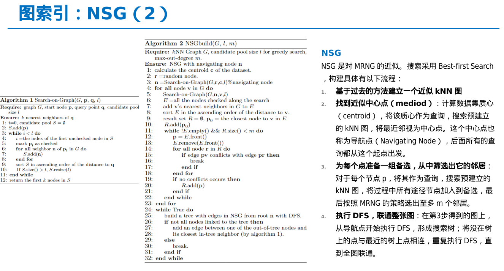

记录 WADG 项目的学习和进展。WADG 基于 NSG。

<!-- more -->

## 参考链接

[NSG 论文](https://dl.acm.org/doi/abs/10.14778/3303753.3303754)

[NSG 论文解读1](https://zhuanlan.zhihu.com/p/50143204)

[NSG 论文解读2](https://songlinlife.github.io/2022/%E6%95%B0%E6%8D%AE%E5%BA%93/%E8%AE%BA%E6%96%87%E9%98%85%E8%AF%BB%EF%BC%9ANSG/)

[NSG 论文解读3](https://blog.csdn.net/chansonzhang/article/details/107775706)

[NSG 代码仓库]()

[efanna 构建 KNN 图]()

[NSG 实验数据集]()


## NSG 论文部分




## WADG_ANN 项目

### 项目环境

#### 依赖准备

构建 KNN 图需要 efanna_graph 项目，efanna_graph 搭建略。

* GCC 4.9+ with OpenMP & OpenBLAS
* CMake 2.8+
* Boost 1.55+
* TCMalloc

```bash
sudo apt-get install libopenblas-dev g++ cmake libboost-dev libgoogle-perftools-dev
```

#### Ubuntu 上编译 NSG

```bash
git clone https://github.com/ZJULearning/nsg.git

cd nsg/

mkdir build/ && cd build/

cmake -DCMAKE_BUILD_TYPE=Release ..

make -j
```


### 数据集


### 运行项目


### NSG 项目代码介绍



#### 1. index_nsg.h

* IndexNSG class
  * 性能统计
    * 平均搜索时间
    * 搜索路径长度
    * 路径中节点出度

#### 2. test_nsg_index.cpp

#### 3. test_nsg_search.cpp


### WADG 项目代码修改

#### 1. LRUCache.h & LRUCache.cpp

对 LRU 队列的实现和封装，通过 `std::vector` 实现。

* 加入到 LRU 头部：`put(id)`
* 访问 LRU index 位置数据：`get(index)`

#### 2. dkm.hpp

一个性能较好的 kmeans 库，接收数据格式为：`std::vector<std::array<T, N>>`。

* 修改 dkm 接收数据格式为：`std::vector<std::vector<T>>`，并确保第二维 vector 长度固定


#### 3. index_wasg.h

* IndexWADG class，继承于 IndexNSG class
  * 参数
    * 聚类 
      1. 搜索请求聚类窗口大小：`window_size`
      2. 聚类中心数量：`cluster_num`
    * 热点 LRU 队列长度（不小于聚类中心数量）：`max_hot_points_num`

  * Search()
    * 使用 LRU 缓存做存储热点
    * LRU 初始化随机选取节点，类似于冷启动
    * 依然使用 Greedy Search，从缓存中选取离搜索目标最近的 L 个点作为初始队列（init_ids）
    * 将距离搜索目标最近的热点（初始队列中第一个节点）放到 LRU 缓存头部（该 LRU 根据距离排序 id）
    * 记录搜索目标，定期对搜索目标做热点识别和热点更新
    * 接下来与 Greedy Search 相同，返回 K 个搜索结果

  * 热点识别
    * 使用聚类算法（K-means）对过去一段时间窗口内的访问记录做**聚类** 
      * 热点识别不能阻塞搜索
    * 以**每个聚类中心为搜索目标**进行 Search，将搜索结果中最近的点作为热点
      * Search 函数调用 K 次，每次取搜索结果的第一个点，最后得到 K 个热点
      * 热点识别过程中不记录搜索请求

  * 热点更新
    * 将新生成的 K 个热点放到 LRU 头部，同时淘汰掉 LRU 尾部的 K 个过期热点 
      * 热点更新可能阻塞搜索，需要线程同步

  * 性能统计
    * 平均搜索时间
    * 热点识别时间
    * 热点更新时间
    * 搜索路径长度
    * 路径中节点出度

#### 4. index_wasg.cpp

实现 IndexWADG.h

* （单线程版）Search(query, parameters, indices)
  * 当 query_list 长度达到 window_size，进行热点识别和热点更新
  * 热点识别和热点更新期间不进行 record_query

* update_hot_points(search_res)
  * search_res 中保存了 K 个热点，加入到 LRU 中

* get_cluster_centers()
  * 调用 dkm 库得到聚类中心
  * 需要转化接收的数据格式
